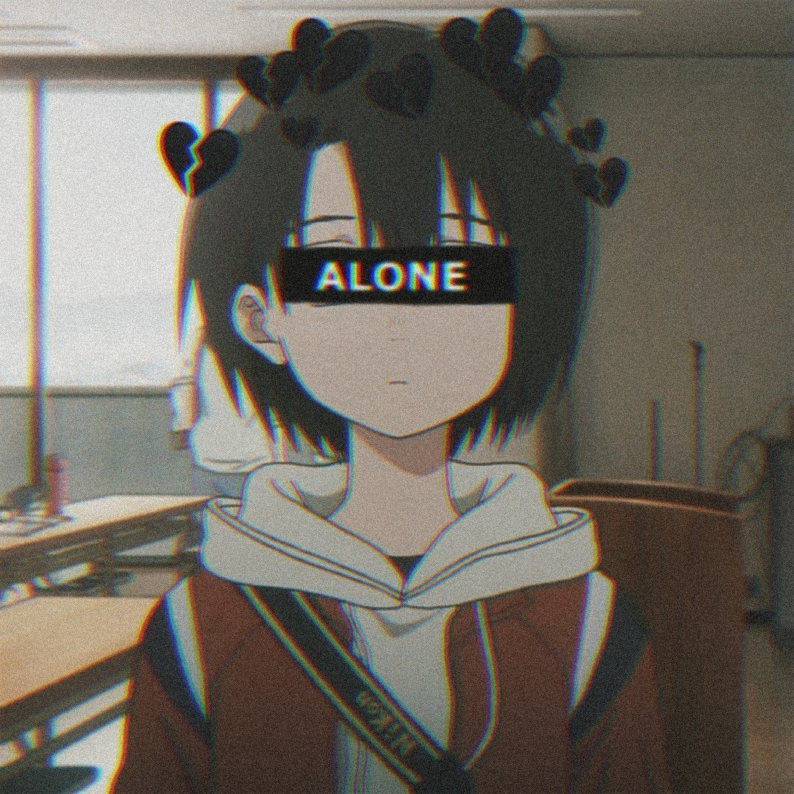

<h1 align="center">🌹 Selfbot Whatsapp</h1>

## 🔖 Deploy to Heroku
> https://heroku.com/deploy?template=https://github.com/IAmAdyy/Selfbot

### ❗ Heroku Bulidpack
> https://github.com/jonathanong/heroku-buildpack-ffmpeg-latest
> https://github.com/clhuang/heroku-buildpack-webp-binaries

## 🌹 Run on Repl.It<
> https://repl.it/github/IAmAdyy/Selfbot

## `>_` Install di Termux/Vps
```cmd
apt install install git nodejs ffmpeg libwebp
git clone https://github.com/IAmAdyy/Selfbot
cd Selfbot
npm i
node .
```
##### Note : If `apt install libwebp` didn't work
##### Use `apt install webp`


## 🖥️ Install di Windows
 Prerequisites
* [Node.js](https://nodejs.org/en/)
* [Git](https://git-scm.com/downloads)
* [FFmpeg](https://github.com/BtbN/FFmpeg-Builds/releases/download/autobuild-2020-12-08-13-03/ffmpeg-n4.3.1-26-gca55240b8c-win64-gpl-4.3.zip)
* [Libwebp](https://developers.google.com/speed/webp/download)
```cmd
git clone https://github.com/IAmAdyy/Selfbot
cd Selfbot
npm i
node .
```

# Thanks to
- [AdulAlhy](github.com/adulalhy)

### Next Update!!!
- () Welcome Button
- () By Reply
